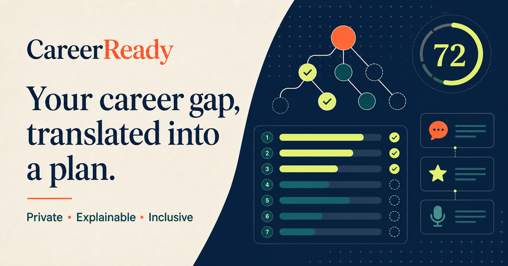

# CareerReady

**AI that opens doors—not another gatekeeper.**

CareerReady is a private, explainable career coach for students and first-time job seekers. It translates any job listing into an evidence-based readiness map, turns missing skills into a seven-day proof-building sprint, and helps users rehearse stronger interview answers.

Built for **SFHS Code Hack 7.0 — AI for Good**, under **AI for Smarter Learning**.

**Live prototype:** https://careerready-sfhs.finart.chatgpt.site



## The problem

Most career tools assume users already understand job-market language, have polished résumés, and can pay for coaching. A single unexplained “match score” can become another gatekeeper—especially for students whose strongest evidence comes from school projects, volunteering, or informal experience.

CareerReady treats those experiences as evidence. It explains every signal, recommends a small next step, and keeps personal career data on the user's device.

## What makes it different

- **Explainable matching:** every skill score links back to evidence found in the user's own words.
- **Proof, not just advice:** gaps become a seven-day sprint that ends with portfolio artifacts, résumé bullets, and an application pack.
- **Private on-device AI:** a quantized MiniLM sentence-embedding model compares meaning in the browser. Résumé text is not sent to an application server.
- **Reliable live demo:** if the model cannot warm up quickly, a transparent local evidence engine returns an instant result.
- **Inclusive by design:** school projects, volunteering, and informal work are treated as valid experience; degree prestige is not scored.
- **Adaptive practice:** interview feedback checks for context, personal action, and outcome instead of making vague personality judgments.

## Working prototype

1. Choose a sample pathway or paste your own experience and job listing.
2. Turn on the privacy shield and select **Map my path**.
3. Inspect the readiness score and the evidence behind every skill.
4. Mark daily proof-building tasks complete; progress persists on the device.
5. Rehearse an interview answer and receive actionable structure feedback.

## Technology

- Next.js-compatible Vinext + React 19 + TypeScript
- Cloudflare Workers-compatible build
- `@huggingface/transformers` with `Xenova/all-MiniLM-L6-v2` for browser-based semantic similarity
- Local, explainable evidence scoring and `localStorage` progress persistence
- Lucide icons and a responsive, accessible custom interface
- Optional Convex account (email + password) to sync progress across devices — see below

No account, database, or paid API is required to use the prototype anonymously.

## Accounts & cross-device sync (optional, Convex)

Signing in is optional. Without an account, everything works exactly as before
(local-only, `localStorage`). Creating an account (email + password, no email
verification) additionally syncs your profile, target listing, role, and
sprint progress to Convex so they follow you across devices.

Backend code lives in `convex/`. To wire it up:

1. **GitHub secret**: add `CONVEX_DEPLOY_KEY` under repo Settings → Secrets
   and variables → Actions, using a deploy key from your Convex project
   dashboard. Pushing to `main` (or running the "Deploy Convex" workflow
   manually) then deploys `convex/` and provisions Convex Auth's JWT keys and
   `SITE_URL` automatically (only on first run; safe to re-run).
2. **Cloudflare Pages**: set `NEXT_PUBLIC_CONVEX_URL` as a build environment
   variable (Settings → Environment variables) to
   `https://<your-deployment-name>.convex.cloud`, matching the deployment the
   deploy key targets. Without it, the app builds and runs fine with accounts
   simply not shown (`CONVEX_ENABLED` in `app/page.tsx` gates the feature).
3. **Local dev**: copy `.env.local.example` to `.env.local` and fill in the
   same URL.
4. Once deployed, double-check `npx convex env get SITE_URL` matches your real
   production domain — the workflow seeds a placeholder on first run.

## Run locally

Requirements: Node.js 22.13+ and npm.

```bash
npm install
npm run dev
```

Open the local URL printed in the terminal. To validate a production build:

```bash
npm run build
```

## Privacy, safety, and ethics

- Candidate text stays in the browser; the app does not create a server-side candidate profile.
- The score is a learning aid, not a hiring recommendation.
- Protected characteristics, school prestige, photographs, and personality are not scored.
- Users can see the evidence behind every result and are encouraged to challenge or ignore it.
- The prototype deliberately avoids medical, psychological, or employability diagnoses.
- A production version would add model-card documentation, multilingual bias testing, consented analytics, deletion controls, and an independent fairness audit before real-world deployment.

## AI usage disclosure

This project was created during the hackathon with AI assistance, as permitted by the event rules.

| AI tool | Purpose | Extent of contribution |
| --- | --- | --- |
| Claude | Initial brainstorming and early technical-spec discussion | Suggested a broad CareerReady concept and possible stack. The final product direction and implementation were substantially refined afterward. |
| OpenAI Codex | Product strategy, interface implementation, TypeScript/CSS, debugging, build validation, README and submission preparation | Major development assistant. All generated work was reviewed and integrated as part of this repository. |
| OpenAI image generation | Social-preview artwork | Generated `public/og.png` from a project-specific art direction prompt. |
| MiniLM (`Xenova/all-MiniLM-L6-v2`) | Runtime semantic matching | The shipped app uses this open model in the browser to compare a user's experience with a target opportunity. |

No AI-generated output is presented as professional hiring advice. The product explains that its results are guidance and keeps the user in control.

## Judging alignment

| Criterion | Evidence in the prototype |
| --- | --- |
| Innovation & originality | Closes the loop from semantic gap analysis to proof-building and interview rehearsal; uses private on-device inference. |
| Practicality & viability | Works without accounts, a database, or API cost; includes reliable samples and fallback behavior. |
| User experience | Responsive, keyboard-friendly journey with plain-language copy, progressive disclosure, and clear feedback. |
| Business value | A school, NGO, or placement cell can offer scalable coaching while preserving student privacy. |
| Societal impact | Helps first-time applicants translate informal experience without prestige or degree filters. |
| Presentation | One cohesive before → plan → proof story that can be demonstrated in under three minutes. |

## Team

- **Team name:** _Add before submission_
- **Members and roles:** _Add 2–4 team members before submission_
- **Hackathon:** SFHS Code Hack 7.0 Innovation Challenge

## Submission checklist

- [ ] Add team name and all member roles above
- [x] Add the deployed application link near the top of this README
- [ ] Record and add the 2–5 minute demo video
- [ ] Add the presentation PDF/PPT to the repository
- [ ] Confirm the final repository is public or accessible to judges
- [ ] Submit all links before 8:00 AM on 2 August 2026

## License

Created for SFHS Code Hack 7.0. Add your chosen open-source license before submission.
